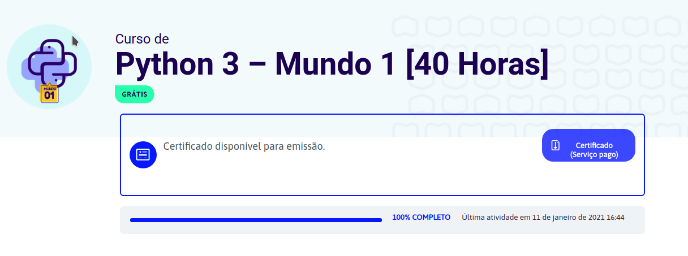

# PYTHON 3 - MUNDO 1 [40 HORAS]

Curso de Python do professor Guanabara do Curso em vídeo.

Minha intenção é aprender e me aperfeiçoar na linguagem Python, deixando todo meu aprendizado registrado aqui no Github.

Curso: https://www.cursoemvideo.com

## CURSO CONCLUIDO EM 11/1/2021

